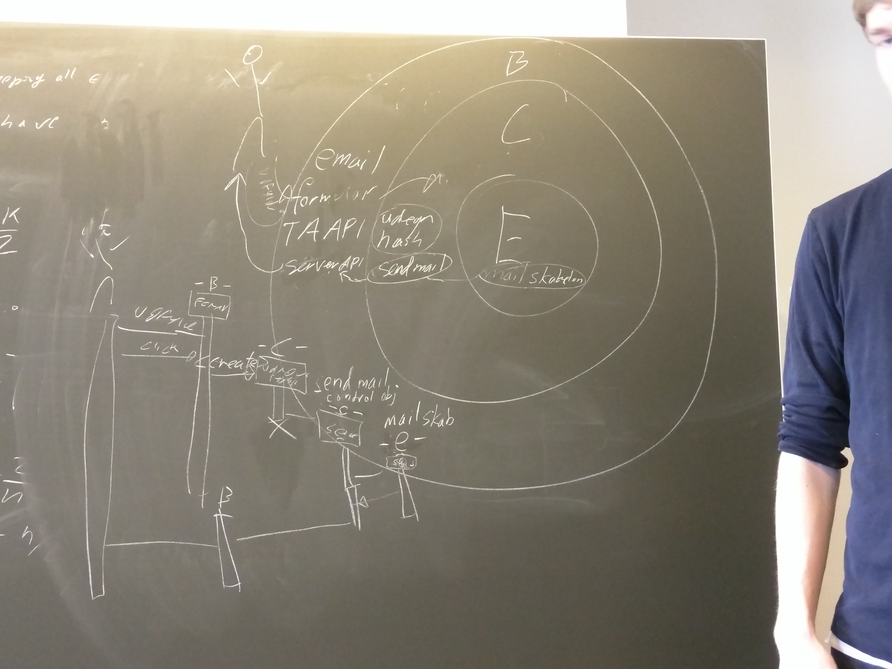

NGINX passer ikke ind nogle steder. I BCE model.

Argumenter for email og form er boundary objecter, kig i bogen efter arugmentation.

Control objecter er cirka funktioner.

Boundary starter et control object.

Udregn hash er control, mail skabelon er en entity, så går den ud til send mail som er control. Som sender til server API. Se billede.

